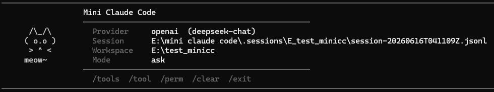

# Mini Claude Code



A minimal CLI coding agent powered by Claude or DeepSeek. Built in Python with zero framework dependencies. Talk to your codebase in natural language — the agent reads, writes, searches, runs shell commands, and fixes bugs autonomously.

## Features

- **Streaming output** — responses appear character-by-character in real time, no waiting for full generation
- **Agent Loop** — user input → LLM → tool calls → loop → final answer (configurable max rounds)
- **6 tools** — read_file, write_file, list_files, search_files, git_diff, run_shell
- **Dual LLM backend** — Anthropic Claude + DeepSeek (OpenAI-compatible) via clean provider abstraction
- **Permission system** — 3 modes (plan / ask / auto) with interactive keyboard menu and high-risk command detection
- **Workspace sandbox** — all file I/O restricted to a workspace directory with path-escape protection
- **JSONL session logging** — append-only, 7 event types, auto-cleanup of empty sessions
- **Session resume** — organized by workspace, interactive picker with session names and timestamps
- **Context compaction** — auto-summarizes old messages when history exceeds 30 messages
- **CLAUDE.md** — project-level instructions injected live into the system prompt
- **Styled terminal UI** — colored prompts, mode indicator, horizontal rules, ASCII cat banner, `--no-color` for CI

## Installation

```bash
git clone https://github.com/wxd-hash/mini-CC.git
cd mini-CC
python -m venv .venv

# Windows
.venv\Scripts\python.exe -m pip install -r requirements.txt

# macOS / Linux
.venv/bin/pip install -r requirements.txt
```

### Global command (optional)

```bash
.venv\Scripts\python.exe -m pip install -e .
```

Then use `minicc` from any directory — the current working directory becomes the workspace.

## Environment

Set your API key before launching:

```powershell
# PowerShell
$env:ANTHROPIC_API_KEY = "sk-ant-..."    # Claude
$env:DEEPSEEK_API_KEY = "sk-..."          # DeepSeek
```

```bash
# Bash / Zsh
export ANTHROPIC_API_KEY="sk-ant-..."
export DEEPSEEK_API_KEY="sk-..."
```

## Usage

```bash
# Default (Anthropic, ask mode)
python main.py

# DeepSeek with streaming
python main.py --provider deepseek

# Point to a different project
python main.py --workspace E:\my_project

# CI / pipe-friendly (no ANSI colors)
python main.py --no-color

# Global command (after pip install -e .)
minicc --provider deepseek
```

### CLI options

| Flag | Default | Description |
|---|---|---|
| `--provider anthropic\|deepseek` | `anthropic` | LLM provider |
| `--model MODEL` | provider default | Override model name |
| `--api-key KEY` | env var | API key |
| `--api-base URL` | DeepSeek official | API base URL (DeepSeek only) |
| `--workspace PATH` | `./workspace` | Workspace root directory |
| `--log-dir PATH` | `./.sessions` | Session log directory |
| `--mode plan\|ask\|auto` | `ask` | Permission mode |
| `--resume` | — | Show session picker for this workspace |
| `--no-color` | — | Disable ANSI color output |

### Slash commands

| Command | Description |
|---|---|
| `/exit` | Quit and clean up |
| `/tools` | List all registered tools |
| `/tool <name> <json>` | Manual tool call (bypasses LLM) |
| `/perm <plan\|ask\|auto\|status>` | Switch or view permission mode |
| `/clear` | Reset conversation history |

## Permission modes

| Mode | read / list / search / git_diff | write_file | run_shell |
|---|---|---|---|
| **plan** | auto-allow | denied | denied |
| **ask** | auto-allow | interactive menu | interactive menu |
| **auto** | auto-allow | auto-allow | low-risk auto / high-risk menu |

The permission menu supports keyboard navigation: `↑↓` / `ws` / `jk` to move, `Enter` to confirm, `Esc` to cancel. Three options per prompt: **Yes**, **Yes, and don't ask again**, **No**.

High-risk shell commands: `rm`, `sudo`, `curl`, `wget`, `ssh`, `scp`, `chmod`, `chown`, `git push`, `pip install`, `npm install`.

"Don't ask again" auto-allows the tool for the rest of the session except for high-risk commands (always prompt). Permission state never persists between sessions.

## Tools

| Tool | Input | Behavior |
|---|---|---|
| `read_file` | `path` | UTF-8 read, max 12000 chars with truncation notice |
| `write_file` | `path`, `content` | Creates parent dirs, returns absolute path and char count |
| `list_files` | `path` (optional, default `.`) | Up to 200 entries with file sizes, ignores `.git`/`__pycache__`/`node_modules`/`.venv` |
| `search_files` | `query`, `path` (optional) | Tries ripgrep first for speed, falls back to pure Python; skips binary, max 100 matches |
| `git_diff` | `path` (optional), `staged` (optional) | Read-only, supports `--staged` flag, friendly message if not a git repo |
| `run_shell` | `command` | 30s timeout, GBK/UTF-8 auto-detection, venv PATH injected |

## Sessions & resume

Sessions are stored in `.sessions/` organized by workspace:

```
.sessions/
├── E_test_minicc/
│   ├── session-20260615T103402Z.jsonl
│   └── session-20260615T110000Z.jsonl
└── E_mini_claude_code_workspace/
    └── session-20260615T100000Z.jsonl
```

Each session is a JSONL file with 7 event types: `user_input`, `assistant_text`, `tool_use`, `tool_result`, `permission_denied`, `error`, `compact`.

Resume shows an interactive picker with session name (first user message) and last activity time:

```bash
python main.py --workspace E:\my_project --resume
```

```
Select a session to resume:
──────────────────────────────────────────────
  ▸ Fix failing pytest tests             06-15 11:30
    Create a hello world script          06-15 10:15
    (start fresh)
```

The full conversation history is loaded and displayed in the terminal. Empty sessions (no user messages) are automatically deleted.

## CLAUDE.md

Place a `CLAUDE.md` in your workspace root to inject project instructions. The file is re-read before every LLM call, so edits take effect immediately — no restart needed.

```markdown
# Project Instructions
- Project uses Python
- Run pytest after every change
- Keep code simple, avoid over-abstraction
- Dependencies go in pyproject.toml
```

## Project structure

```
mini-claude-code/
├── main.py                      # Entry point (CLI parsing only)
├── test_all.py                  # 37 self-tests (no API key needed)
├── pyproject.toml
├── requirements.txt
├── README.md
├── .gitignore
├── .sessions/                   # Session log directory (data ignored)
├── fig/                         # Banner image
└── src/
    ├── __init__.py
    ├── app.py                   # Application wiring (provider, tools, agent)
    ├── config.py                # Global config (model, thresholds, max rounds)
    ├── context.py               # System prompt builder + compaction
    ├── terminal.py              # ANSI styling, menus, paste detection, no-color
    ├── repl.py                  # Interactive loop, banner, prompt
    ├── commands.py              # Slash commands + resume handlers
    ├── agent/
    │   ├── __init__.py
    │   └── loop.py              # MiniClaudeAgent (LLM ↔ tool loop)
    ├── llm/
    │   ├── __init__.py
    │   ├── provider.py          # LLMProvider ABC + ToolCall/LLMResponse
    │   ├── anthropic_provider.py  # Anthropic with streaming
    │   └── openai_provider.py     # OpenAI/DeepSeek with streaming
    ├── tools/
    │   ├── __init__.py
    │   ├── base.py              # Tool ABC
    │   ├── registry.py          # ToolRegistry (Anthropic + OpenAI schemas)
    │   ├── file_tools.py        # ReadFile, WriteFile, ListFiles, SearchFiles
    │   ├── shell_tool.py        # RunShell (encoding auto-detect, venv PATH)
    │   └── git_tools.py         # GitDiff (unstaged + staged)
    ├── workspace/
    │   ├── __init__.py
    │   └── sandbox.py           # Path sandbox (escape prevention)
    ├── security/
    │   ├── __init__.py
    │   └── permission.py        # PermissionManager (plan/ask/auto + menus)
    └── session/
        ├── __init__.py
        └── logger.py            # JSONL logger + resume + cleanup
```

## Quick test

```bash
# Run all 37 unit tests (no API key required)
python test_all.py

# Demo: fix a bug with the agent
python main.py --provider deepseek
> Run the tests and fix any failures
```
